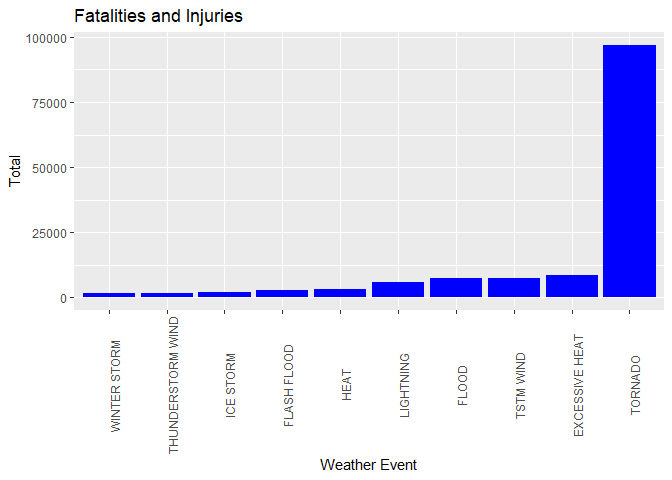
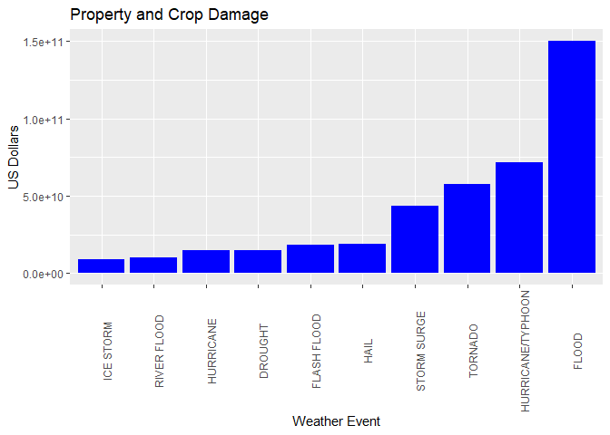

Reproducible Research Project 2
================
Skylar Trigueiro
January 30, 2021

# Introduction

In this report, I will explore how destructive certain storms can be. I will attempt to determine which storms are the most deadly to people and also which storms cause the most economic damage. First let's get a sense for the size of the data.

This data set contains a lot of features that aren't necessary for the analysis that we're doing so I'm only going to look at the features which I believe are necessary for the analysis.

``` r
data <- read.csv("data/repdata_data_StormData.csv.bz2")
featsToKeep <- c("EVTYPE", "FATALITIES", "INJURIES", "PROPDMG", "PROPDMGEXP", "CROPDMG", "CROPDMGEXP")
data <- data[featsToKeep]
dim(data)
```

    ## [1] 902297      7

# Data Analysis

``` r
str(data)
```

    ## 'data.frame':    902297 obs. of  7 variables:
    ##  $ EVTYPE    : chr  "TORNADO" "TORNADO" "TORNADO" "TORNADO" ...
    ##  $ FATALITIES: num  0 0 0 0 0 0 0 0 1 0 ...
    ##  $ INJURIES  : num  15 0 2 2 2 6 1 0 14 0 ...
    ##  $ PROPDMG   : num  25 2.5 25 2.5 2.5 2.5 2.5 2.5 25 25 ...
    ##  $ PROPDMGEXP: chr  "K" "K" "K" "K" ...
    ##  $ CROPDMG   : num  0 0 0 0 0 0 0 0 0 0 ...
    ##  $ CROPDMGEXP: chr  "" "" "" "" ...

The following code is just to see what the different types of units being used are.

``` r
unique(data$PROPDMGEXP)
```

    ##  [1] "K" "M" ""  "B" "m" "+" "0" "5" "6" "?" "4" "2" "3" "h" "7" "H" "-" "1" "8"

``` r
unique(data$CROPDMGEXP)
```

    ## [1] ""  "M" "K" "m" "B" "?" "0" "k" "2"

The following code will convert the cost units to their integer value and then I will combine the information into a single feature which accounts for the units used.

``` r
# Account for units.

data$PROPEXP[data$PROPDMGEXP == "+"] <- 0
data$PROPEXP[data$PROPDMGEXP == "-"] <- 0
data$PROPEXP[data$PROPDMGEXP == "?"] <- 0
data$PROPEXP[data$PROPDMGEXP == ""] <- 1
data$PROPEXP[data$PROPDMGEXP == "0"] <- 1
data$PROPEXP[data$PROPDMGEXP == "1"] <- 10
data$PROPEXP[data$PROPDMGEXP == "H"] <- 1e2
data$PROPEXP[data$PROPDMGEXP == "h"] <- 1e2
data$PROPEXP[data$PROPDMGEXP == "2"] <- 1e2
data$PROPEXP[data$PROPDMGEXP == "K"] <- 1e3
data$PROPEXP[data$PROPDMGEXP == "3"] <- 1e3
data$PROPEXP[data$PROPDMGEXP == "4"] <- 1e4
data$PROPEXP[data$PROPDMGEXP == "5"] <- 1e5
data$PROPEXP[data$PROPDMGEXP == "M"] <- 1e6
data$PROPEXP[data$PROPDMGEXP == "m"] <- 1e6
data$PROPEXP[data$PROPDMGEXP == "6"] <- 1e6
data$PROPEXP[data$PROPDMGEXP == "7"] <- 1e7
data$PROPEXP[data$PROPDMGEXP == "8"] <- 1e8
data$PROPEXP[data$PROPDMGEXP == "B"] <- 1e9


data$PROPVAL <- data$PROPDMG * data$PROPEXP

data$CROPEXP[data$CROPDMGEXP == "?"] <- 0
data$CROPEXP[data$CROPDMGEXP == "0"] <- 1
data$CROPEXP[data$CROPDMGEXP == ""] <- 1
data$CROPEXP[data$CROPDMGEXP == "2"] <- 1e2
data$CROPEXP[data$CROPDMGEXP == "K"] <- 1e3
data$CROPEXP[data$CROPDMGEXP == "k"] <- 1e3
data$CROPEXP[data$CROPDMGEXP == "M"] <- 1e6
data$CROPEXP[data$CROPDMGEXP == "m"] <- 1e6
data$CROPEXP[data$CROPDMGEXP == "B"] <- 1e9

data$CROPVAL <- data$CROPDMG * data$CROPEXP

data$ECONCONS <- data$PROPVAL + data$CROPVAL
```

``` r
head(data$ECONCONS)
```

    ## [1] 25000  2500 25000  2500  2500  2500

``` r
data$HEALTHCONS <- data$FATALITIES + data$INJURIES
```

# Results

``` r
library(ggplot2)
```

``` r
sumHealthCons <- aggregate(HEALTHCONS ~ EVTYPE, data = data,  FUN="sum")

topTenHeathEvents <- sumHealthCons[order(sumHealthCons$HEALTHCONS, decreasing = TRUE), ][1:10, ]

healthGraph <- ggplot(data=topTenHeathEvents, aes(x=reorder(EVTYPE, HEALTHCONS), y=HEALTHCONS)) +
  geom_bar(fill="blue",stat="identity")  + 
  xlab("Weather Event") + ylab("Total") +
  ggtitle("Fatalities and Injuries") + 
  theme(axis.text.x = element_text(angle = 90))

healthGraph
```



Tornadoes cause the most combined fatalities and injuries so I would consider them the event with the most health consequences.

``` r
sumEconCons <- aggregate(ECONCONS ~ EVTYPE, data = data,  FUN="sum")

topTenEconEvents <- sumEconCons[order(sumEconCons$ECONCONS, decreasing = TRUE), ][1:10, ]

EconGraph <- ggplot(data=topTenEconEvents, aes(x=reorder(EVTYPE, ECONCONS), y=ECONCONS)) +
  geom_bar(fill="blue",stat="identity") +
  xlab("Weather Event") + ylab("US Dollars") +
  ggtitle("Property and Crop Damage") +
  theme(axis.text.x = element_text(angle = 90))

EconGraph
```



Flooding damage is the weather event with the most property and crop damage.
